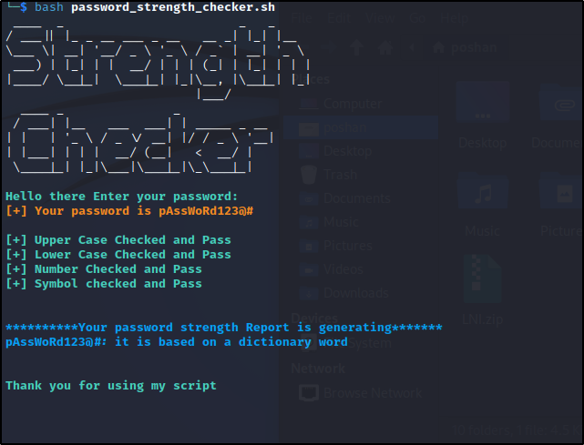
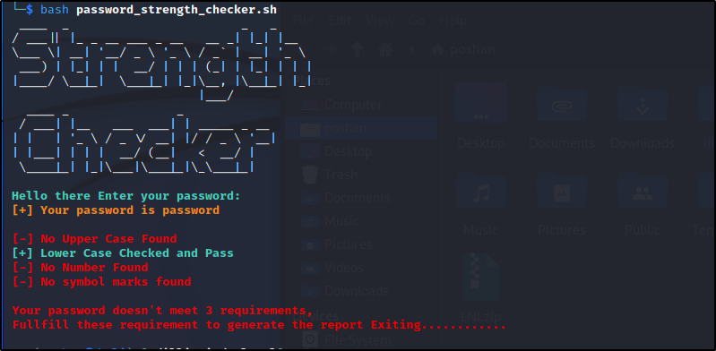

# Password_strength_checker
A bash script to validate your password and check strength of your password

## Work flow

The script expects the password from the user, and checks whether it contains the combination of lower case, uppercase, numbers, and symbols. Once the password pass all the checks, the script runs the libcrack library which checks the password against different wordlist and provides the one line report.

### Case 1: Generating the report after all checks pass

### Case 2: When password requirement doesn't meet

